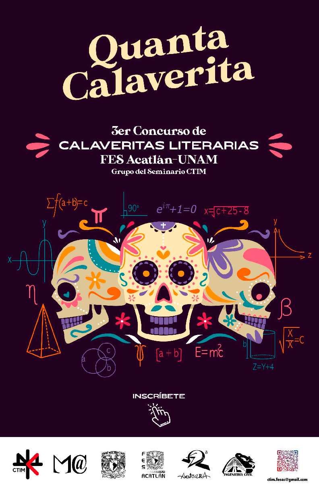
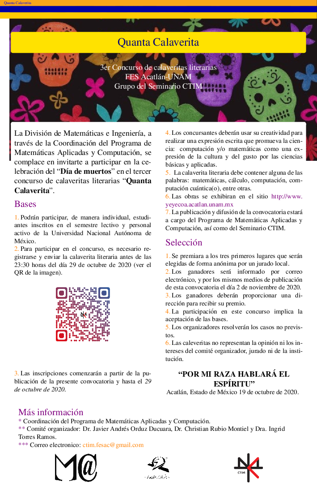
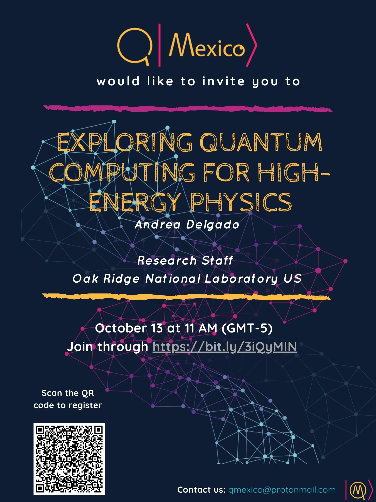

<!-- badges -->
<!-- badges -->
[license-badge]: https://img.shields.io/badge/Licencia-CC-orange
[license]: https://creativecommons.org/licenses/by-nc-sa/3.0/deed.es
[![CC License][license-badge]][license]

## Academic Activities

[Go back](../)

## Contents

1. [STEM Seminar](#stemsem)
1. [Quanta Calaverita](#quantacal)
1. [QMexico](#qmexico)

# STEM Seminar 
We want to see you in the seminar in the 
[youtube channel](https://www.youtube.com/channel/UC0xcSLbzXcggYuz182gABaA/live){:target="_blank"}, 
while we have to stay at home. 

1. Juan Pablo Tellez.
Talk: Los seguros en la era dígital

# Quanta Calaverita 
This entanglement event integrates computing, mathematics and, 
general science, with the mexican traditions in an academic 
environment where people can participated with calaverita which 
must contain applied, maths and engineering concepts.

Submit your _Calaverita_
[https://tinyurl.com/yyhhzbog](https://tinyurl.com/yyhhzbog){:target="_blank"}

Call for _calaveritas_

Past events:
In this link you reach out the previous information.
[https://sites.google.com/view/quantacalaverita](https://sites.google.com/view/quantacalaverita){:target="_blank"}

# QMexico 

This an event higly recommended for enthusiastic people, and interested about Quantum Computing and Quantum Machine Learning.

Besides, you can follow our channel on 

- youtube: [https://www.youtube.com/channel/UCsSBfKzwO8C3A3VA_OxXqqA/live](https://www.youtube.com/channel/UCsSBfKzwO8C3A3VA_OxXqqA/live){:target="_blank"}
- twitter: [https://twitter.com/_QMexico](https://twitter.com/_QMexico){:target="_blank"} 
- facebook: [https://www.facebook.com/qmexico42)(https://www.facebook.com/qmexico42){:target="_blank"} 
- Github: [https://qmexico.github.io/](https://qmexico.github.io/){:target="_blank"}

 

<!---

**Figure 1**: Quanta Calaverita 2019. 

1. [Arturo Erdely](https://sites.google.com/site/arturoerdely/){:target="_blank"}.
Talk: Midiendo el pulso de la epidemia

We will published soon...

--->

<!--- JO: with the original template --->
[Go back](../)

<!--- 

room pass

pr0gr4m4c10n2021_1
pr0gr4m4c10n2021_1

Change Mod password
programacion_2020-1
programacion_2020-1
programacion_2020-1

Chnge mode message

B13nv3n1d0s2020
B13nv3n1d0s2020
B13nv3n1d0s2020

--->
